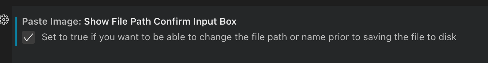

## 方案
- 文档构建: [docsify](https://github.com/docsifyjs/docsify)
- 静态网站: GitHub page
- 编辑器: vscode

### 一些特殊处理

#### 自动生成侧边栏
[docsify-cli](https://github.com/docsifyjs/docsify-cli) `4.4.4` 有自动生成侧边栏的命令，但不是很好用，生成一次之后就无法更新，会提示文件已经存在，而且不支持多级目录嵌套。

所以决定参考[搭建个人博客，Docsify+Github webhook+JGit解决方案](https://zhuanlan.zhihu.com/p/529984860)自己处理下

#### 截图
用的vscode插件`paste image`

可以配置文件存放的前缀

默认是自动保存的，但你也可以配置为在保存前先修改文件名
